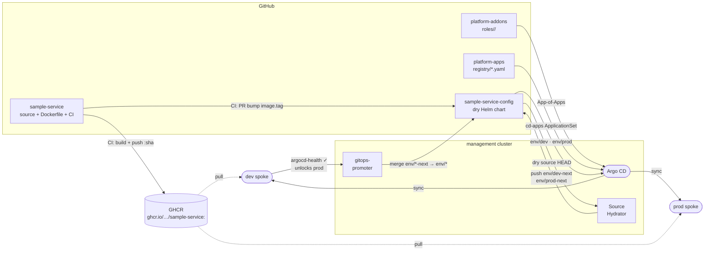

# CLAUDE.md

This file provides guidance to Claude Code (claude.ai/code) when working with code in this repository.

## Delivery pipeline

## Architecture

This repo is the source side of the pipeline. On every push to `main`, CI:

1. Runs `go test ./...`
2. Builds a multi-stage Docker image and pushes `ghcr.io/platform-engineer-lab/sample-service:<short-sha>` to GHCR using the built-in `GITHUB_TOKEN`
3. Opens a PR into `sample-service-config` bumping `chart/values.yaml` `image.tag` to the new SHA, authenticated via a GitHub App (`APP_ID` + `APP_PRIVATE_KEY` secrets)

The image tag bump is the only thing that triggers the promotion pipeline — all delivery config lives in `sample-service-config`.

## Key conventions

- CI pushes immutable `:<sha>` tags only — `:latest` is never published. The GHCR package must be public so spoke clusters can pull without credentials.
- The GitHub App used by CI must be installed on both `sample-service` and `sample-service-config` with **Contents: read/write** and **Pull requests: read/write**.
- Required repo secrets: `APP_ID` and `APP_PRIVATE_KEY`.
