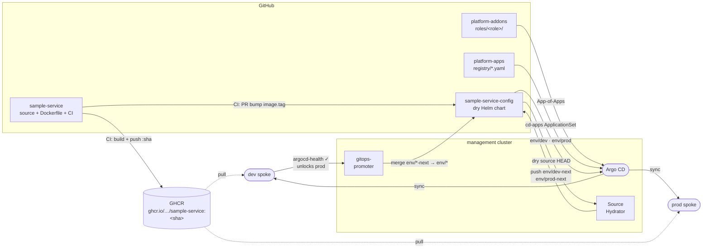

# sample-service

Minimal Go HTTP service used to demonstrate the gitops-promoter promotion pipeline.

## Endpoints

- `GET /` — returns `sample-service <version>`
- `GET /healthz` — returns `ok`

## Delivery pipeline



## How CI works

On every push to `main`:

1. **Test** — `go test ./...`
2. **Build + push** — multi-stage Docker build, image pushed to GHCR as
   `ghcr.io/platform-engineer-lab/sample-service:<short-sha>`
   (uses the built-in `GITHUB_TOKEN`; make the package public in GitHub settings
   so spoke clusters can pull without credentials)
3. **Bump tag** — opens a PR to `sample-service-config` updating `chart/values.yaml`
   `image.tag` to the new SHA.

## Required secrets

CI uses a GitHub App to open PRs into `sample-service-config`. Add two secrets in
this repo's Settings → Secrets → Actions:

| Secret | Value |
|---|---|
| `APP_ID` | GitHub App ID (e.g. `4117391`) |
| `APP_PRIVATE_KEY` | Contents of the downloaded `.pem` private key file |

The App must be installed on both `sample-service` and `sample-service-config` with
**Contents: read/write** and **Pull requests: read/write** permissions.

## Local dev

```bash
go test ./...
go run .
curl localhost:8080/healthz
```
